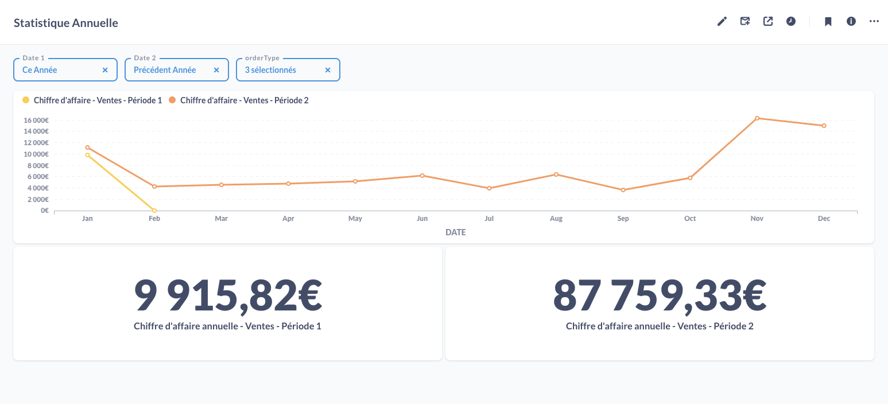
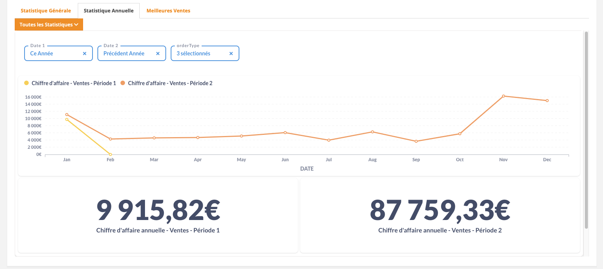
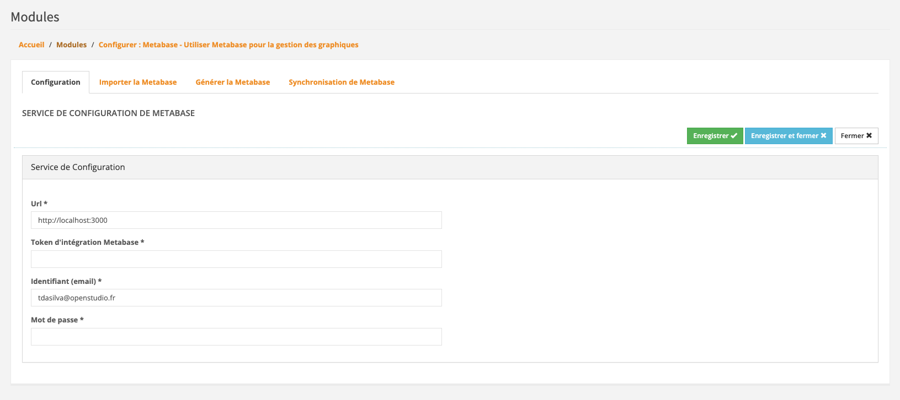
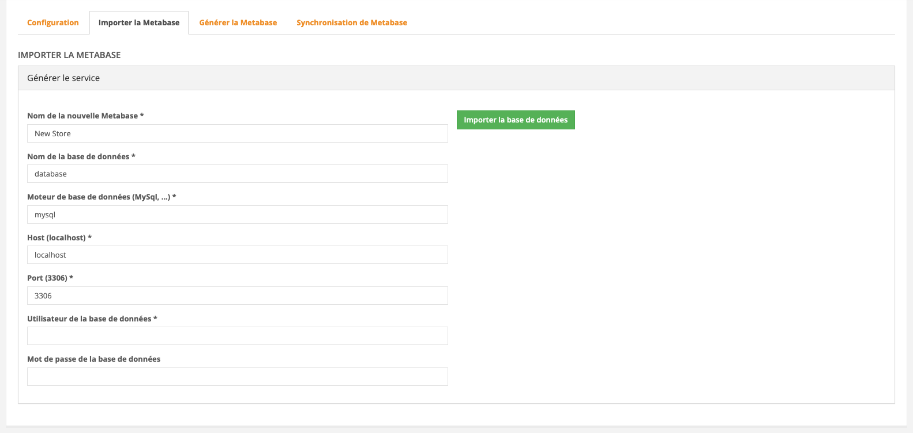
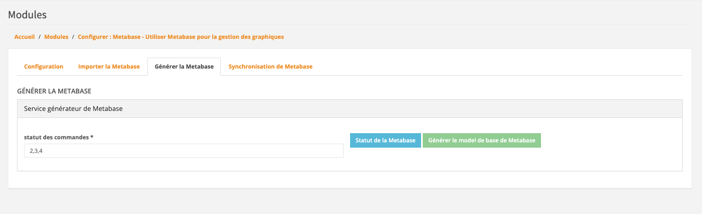
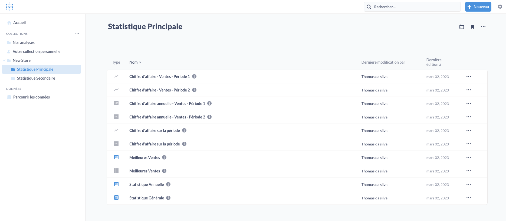
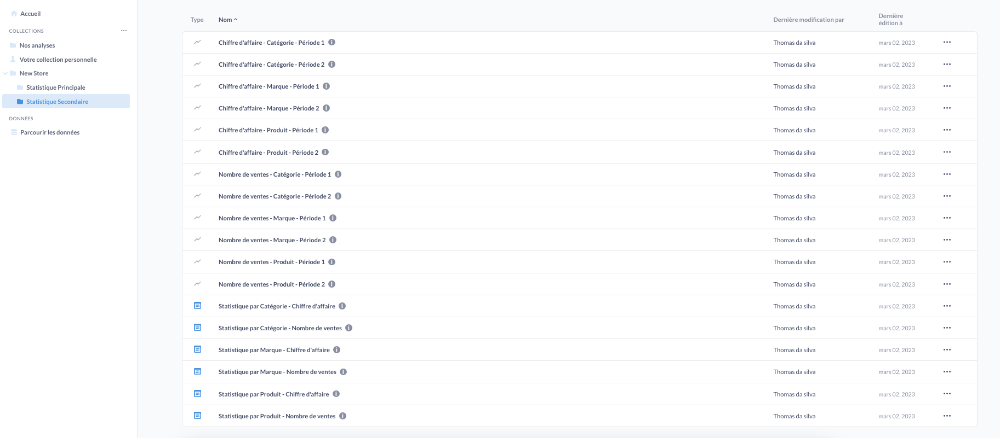
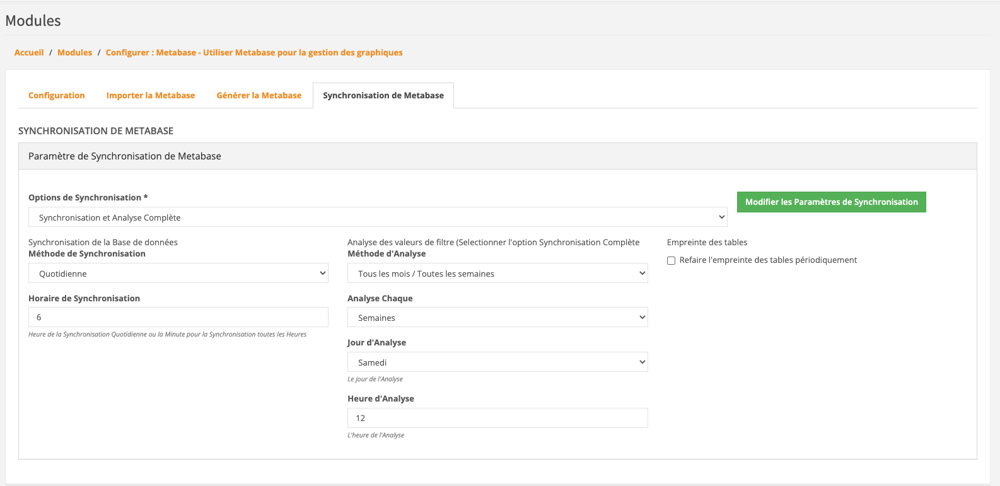

# Metabase

This module was made to integrate [Metabase](https://github.com/metabase/metabase)
Dashboard to your Thelia admin backOffice





Please check [Metabase API Documentation](https://www.metabase.com/docs/latest/api-documentation)
for more detail about Metabase

With this module, you can connect to your Metabase account and print some statistics on admin panel

You can also import you database,
create default Metabase Dashboard and Cards
and modify your metabase synchronization parameters

## Installation

### Manually

* Copy the module into ```<thelia_root>/local/modules/``` directory and be sure that the name of the module is Metabase.
* Activate it in your thelia administration panel

### Composer

Add it in your main thelia composer.json file

```
composer require thelia/metabase-module:~1.0
```

### Usage

#### Configuration
Go to the configuration panel

Configure Metabase with your Url, your mail metabase and your password metabase

To get your integration token : go to https://***your-metabase-url***/admin/settings/embedding-in-other-applications and activate Integration



#### Import your Database

Go to the Import Database Panel



Name of the Metabase will be the name of your Metabase Collection

Then, Complete the form with your database info

The importation of your database can take a while.

#### Generate Metabase

Go to the Generate Metatable panel



complete the order status with the ids (2,3,4)
(2 -> paid, 3 -> processing, 4-> sent)

You will have to click the check button first, if your datatable installation is complete you will be able to generate 
default metabase cards and Dashboard

It will be split in 2 collections :

##### MainStatistic
 * for last 30days Turnover, annual Turnover and Best Seller



##### SecondStatistic
* for Sales and Turnover by products, brands and categories products



note : all names can be change in Metabase translation.

#### Update Syncing

Go to the Update Metabase Syncing Panel



By default, Metabase does a lightweight hourly sync and an intensive daily scan of field values. 
If you have a large database, you should modify syncing option.

##### Database syncing
This is a lightweight process that checks for updates to this database’s schema. 
In most cases, you should be fine leaving this set to sync hourly.

##### Scanning for Filter Values
Metabase can scan the values present in each field in this database to enable checkbox filters in dashboards and questions. 
This can be a somewhat resource-intensive process, particularly if you have a very large database.

##### Periodically refingerprint tables
This enables Metabase to scan for additional field values during syncs allowing smarter behavior, 
like improved auto-binning on your bar charts.

Syncing option :
1. Full Syncing : Activate Syncing and Scan
2. On Demand : Activate Syncing and Scan on the new Filter Value
3. Syncing Only : Scan is not activated